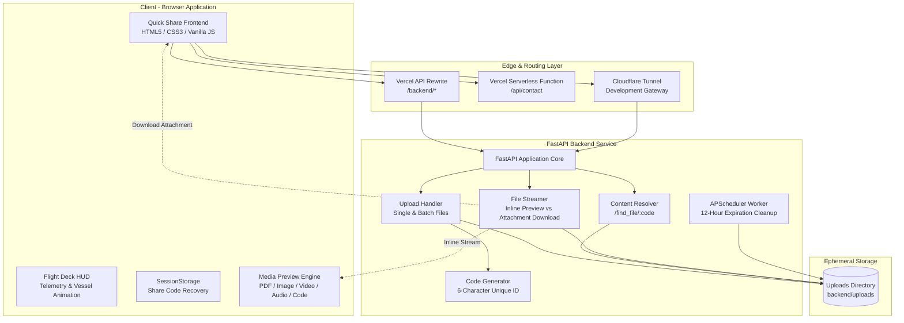

<p align="center">
  
</p>

```text

   ██████  ██    ██ ██  ██████  ██   ██      ███████ ██   ██  █████  ██████  ███████
  ██    ██ ██    ██ ██ ██       ██  ██       ██      ██   ██ ██   ██ ██   ██ ██      
  ██    ██ ██    ██ ██ ██       █████        ███████ ███████ ███████ ██████  █████   
  ██ ▄▄ ██ ██    ██ ██ ██       ██  ██            ██ ██   ██ ██   ██ ██   ██ ██      
   ██████   ██████  ██  ██████  ██   ██      ███████ ██   ██ ██   ██ ██   ██ ███████
      ▀▀                                                                                            

```

A modern, lightweight full-stack sharing app that lets users upload text snippets or files, receive a short code, and retrieve shared content instantly.

## Overview

Quick Share is built for fast, temporary content transfer. Users can:
- Share text snippets with 1-click copy
- Upload single or multiple files under a single 6-letter share code
- Retrieve content with instant code lookup
- **Preview supported file types directly in the browser** (PDFs, images, audio, video, code/text files) without forcing unwanted downloads
- **Download files on demand** using dedicated download actions
- Update previously shared text by code
- Experience interactive upload visuals (Origami Dragon & Jet flight telemetry HUD)

The backend automatically cleans up expired uploads to keep storage lean and ephemeral.

## Project Structure

```text
quick share/
├── .vscode/
│   └── settings.json           (Five Server / Live Server watch ignore rules)
├── fiveserver.config.js        (Five Server development configuration)
├── backend/
│   ├── uploads/                (ephemeral storage for shared files/folders)
│   ├── venv/                   (virtual environment)
│   ├── main.py                 (FastAPI backend application)
│   ├── requirements.txt        (Python dependencies)
│   └── .gitignore
├── frontend/
│   ├── api/
│   │   └── contact.js          (Vercel serverless function for contact form)
│   ├── contact.js              (Contact form client handler)
│   ├── index.html              (Main web application)
│   ├── styles.css              (Glassmorphic design system & themes)
│   ├── vercel.json             (Vercel rewrites for backend proxy)
│   ├── .env                    (Frontend environment variables)
│   └── .gitignore
└── README.md
```

## System Architecture



</details>

### Architectural Workflow

1. **Upload & Ingestion Pipeline**:
   - The user selects one or more files or pastes text.
   - The client tracks real-time progress via `XMLHttpRequest.upload` and updates the interactive flight deck HUD.
   - The backend generates a cryptographically random, uppercase 6-character identifier.
   - Files are stored as either `uploads/{CODE}.{ext}` (single uploads) or inside an isolated batch folder `uploads/{CODE}/{filename}` (multiple uploads).
   - Once successfully saved, the code is returned, displayed with a 1-click **Copy** button, and cached in `sessionStorage` for persistence across refreshes.

2. **Retrieval, Preview & Download Pipeline**:
   - The recipient submits a 6-letter share code to `GET /find_file/{code}` to retrieve content type and file metadata.
   - **Inline Preview**: Requests without `download=true` return `Content-Disposition: inline` with auto-detected MIME types (`application/pdf`, images, videos, audio, text) so the browser renders them seamlessly inside embedded viewers without triggering downloads.
   - **On-Demand Download**: When the user clicks **⬇️ Download**, the client queries the endpoint with `?download=true`, instructing FastAPI to return `Content-Disposition: attachment; filename="{filename}"` to save the file with its original name.

3. **Lifecycle & Storage Management**:
   - `APScheduler` runs an automated background routine every hour.
   - Any uploaded files or folders whose last modification timestamp exceeds `EXPIRATION_SECONDS` (12 hours) are automatically deleted to maintain zero storage bloat and enforce ephemeral privacy.

## Core Features

- **Short-Code Sharing**: Generates unique, memorable 6-letter uppercase share codes.
- **Multiple File Uploads**: Upload multiple files simultaneously, grouped under one share code.
- **In-Browser File Previews (Fixed & Enhanced)**:
  - **PDF Documents**: Rendered inline via embedded browser viewers without triggering unexpected file downloads.
  - **Images**: Responsive image gallery previews (`png`, `jpg`, `jpeg`, `gif`, `webp`, `svg`).
  - **Audio & Video**: Built-in HTML5 media players (`mp4`, `webm`, `mp3`, `wav`, `ogg`, `m4a`).
  - **Code & Text**: Syntax-styled, scrollable text viewer with word-wrap for developer files (`txt`, `md`, `py`, `js`, `ts`, `json`, `css`, `html`, `csv`, etc.).
  - **Unsupported Formats**: Clean fallback banner with direct download action.
- **Dedicated Downloads**: Dedicated download buttons with `?download=true` force correct `Content-Disposition: attachment` headers and preserve original filenames across origins.
- **Persistent Share Code UI**: Generated codes are preserved in `sessionStorage` with a 1-click **Copy Code** button, so codes remain visible even if the browser or development server refreshes.
- **Local Dev Auto-Reload Protection**: Configured `fiveserver.config.js` and `.vscode/settings.json` to only watch the `frontend/` directory, preventing Five Server / Live Server from auto-reloading when the backend saves uploaded files.
- **Interactive Flight HUD**: Origami Dragon and Jet flight deck animation with orbital progress ring, altitude, and velocity telemetry.
- **Automatic Expiration Cleanup**: Background APScheduler cleans up files older than 12 hours.
- **Dual Themes**: Polished light and dark glassmorphic themes with system toggle.
- **Serverless Contact Form**: Sends messages through nodemailer using Vercel Serverless Functions.

## Tech Stack

### Backend
- **Python 3.9+**
- **FastAPI** — High-performance async web framework
- **Uvicorn** — ASGI web server
- **Starlette** — `FileResponse` with configurable `inline` vs `attachment` disposition
- **APScheduler** — Automated background file cleanup
- **Pydantic** & **python-multipart** — Request validation and file upload handling

### Frontend
- **HTML5 & Vanilla JavaScript** — Zero-framework, lightweight, fast client
- **Vanilla CSS3** — Glassmorphic styling with CSS variables and custom animations
- **Vercel Rewrites & Serverless Functions** — Backend API proxy and contact form processing

## Installation & Setup

### 1) Clone the repository

```bash
git clone <your-repo-url>
cd "quick share"
```

### 2) Backend setup

```bash
cd backend
python -m venv .venv
```

Activate virtual environment:

**Windows (PowerShell):**
```powershell
.\.venv\Scripts\Activate.ps1
```

**Windows (CMD):**
```cmd
.\.venv\Scripts\activate.bat
```

**macOS/Linux:**
```bash
source .venv/bin/activate
```

Install dependencies:

```bash
pip install -r requirements.txt
```

Run backend server:

```bash
uvicorn main:app --reload --host 0.0.0.0 --port 8000
```

> **Tip:** If running locally, you can pass `--reload-exclude "uploads/*"` to prevent uvicorn from restarting when new uploads are written.

### 3) Frontend setup

Open `frontend/index.html` with **Five Server** or **Live Server** (port 5500), or run Python's static server:

```bash
# from project root
python -m http.server 5500 --directory frontend
```

Then open:

```text
http://localhost:5500
```

> **Note on Five Server / Live Server:** The included `fiveserver.config.js` and `.vscode/settings.json` automatically prevent Five Server and Live Server from auto-reloading when files are uploaded to `backend/uploads/`.

### 4) Serverless contact form (optional)

The contact form posts to `/api/contact`. For local testing with Vercel CLI:

```bash
cd frontend
npm install
# Create .env with GMAIL_USER and GMAIL_APP_PASSWORD
npx vercel dev
```

## Environment Variables

| Name | Used In | Purpose |
|------|---------|---------|
| `GMAIL_USER` | Serverless Contact API (`frontend/api/contact.js`) | Sender/recipient Gmail address |
| `GMAIL_APP_PASSWORD` | Serverless Contact API (`frontend/api/contact.js`) | Gmail App Password for SMTP authentication |

## API Endpoints

| Method | Endpoint | Description |
|--------|----------|-------------|
| `GET` | `/health` | Health check endpoint (`{"status":"alive"}`) |
| `POST` | `/upload` | Upload text snippet or single file |
| `POST` | `/upload_multiple` | Upload multiple files in a batch folder |
| `PUT` | `/update/{code}` | Update text snippet for an existing code |
| `GET` | `/find_file/{code}` | Retrieve file metadata, text content, or file list |
| `GET` | `/get/{file_id}` | Serve shared file (`?download=true` for download, default `inline` for preview) |
| `GET` | `/get_multiple/{code}/{filename}` | Serve file from multi-upload folder (`?download=true` for download, default `inline` for preview) |
| `GET` | `/view/{code}` | Standalone HTML preview page for shared content |

## Deployment Architecture

```text
User
 │
 ▼
qshareio.vercel.app
 │
 ├── Frontend (HTML/CSS/JS)
 │
 ├── /api/contact
 │      ▼
 │   Vercel Serverless Function (Nodemailer)
 │
 └── /backend/*
        ▼
     Vercel Rewrite
        ▼
     FastAPI Backend (Render / Cloudflare Tunnel)
```

## Security Features

- **Strict CORS policy** tailored for local and production origins
- **Automated file expiration** (12-hour lifespan)
- **Safe preview disposition** preventing unintended executable downloads
- **Backend URL masking** via Vercel rewrites
- **Environment-variable credentials** for serverless mailing

## Contact Information

- **Name:** Rohit Adak
- **Email:** rohitadak0@gmail.com
- **Phone:** +91 8348765905

## Acknowledgement

- Built with FastAPI and vanilla frontend web standards.
- Thanks to the open-source community for the tools powering this project.
